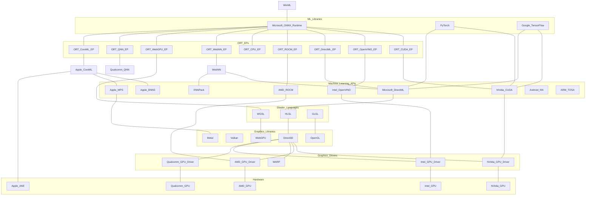

<!--
TODO: Figure out how to add links to Mermaid diagram.

- Apple CoreML https://developer.apple.com/documentation/coreml
- Apple Model Intermediate Language Model Intermediate Language
- Apple MPS Metal Performance Shaders MPSGraph https://developer.apple.com/documentation/metalperformanceshadersgraph/mpsgraph
- Apple BNNS Basic Neural Network Subroutines https://developer.apple.com/documentation/accelerate/bnns
- Apple ANE Apple Neural Engine https://machinelearning.apple.com/research/neural-engine-transformers, https://github.com/hollance/neural-engine
- Google TPU Tensor Processing Unit https://en.wikipedia.org/wiki/Tensor_Processing_Unit
- Google XNNPack https://github.com/google/XNNPACK/blob/master/include/xnnpack.h#L1461C17-L1461C39 <=2021-September-09
- QNNPack Quantized Neural Network https://github.com/pytorch/QNNPACK
- ONNX https://github.com/onnx/onnx/blob/main/docs/Operators.md#Sqrt

TODO: Integrate all/some of these into diagram...

- PyTorch https://pytorch.org/docs/stable/generated/torch.sqrt.html
- TensorFlow https://www.tensorflow.org/api_docs/python/tf/math/sqrt
- ONNX Runtime https://onnxruntime.ai/
- DirectML https://learn.microsoft.com/en-us/windows/ai/directml/dml-intro https://learn.microsoft.com/en-us/windows/win32/api/directml/ns-directml-dml_element_wise_sqrt_operator_desc
- NVIDIA® CUDA® Deep Neural Network LIbrary (cuDNN) " is a GPU-accelerated library of primitives for deep neural networks. It provides highly tuned implementations of operations arising frequently - in DNN applications." https://docs.nvidia.com/deeplearning/cudnn/developer-guide/index.html
- QNN Qualcomm
- ORT QNN EP Qualcomm
- TOSA Tensor Operator Set Architecture https://www.mlplatform.org/tosa/tosa_spec.html
- AMD ROCM
- Intel plaidML "PlaidML is a portable tensor compiler." https://www.intel.com/content/www/us/en/artificial-intelligence/plaidml.html
- OpenCL
- OpenGL
- LLVM IR
- CUDA
- Intel OpenVINO https://www.intel.com/content/www/us/en/developer/tools/openvino-toolkit/overview.html targets "CPU, integrated GPU, Intel Movidius VPU, and FPGAs" https://en.wikipedia.org/wiki/- OpenVINO "write once, deploy anywhere (that has Intel hardware)"
- AMD Vitis ORT EP https://github.com/Xilinx/Vitis-AI, https://onnxruntime.ai/docs/execution-providers/Vitis-AI-ExecutionProvider.html
- Vitis AI DPU Deep Learning Processor Unit
- https://mlir.llvm.org/docs/Dialects/Linalg/
- OpenHLO?
- IREE team? OpenXLA initiative.
- BLAS

- High level: ONNX, PT, TF
- Low level instructions: x86, HLSL, CUDA...
-->
